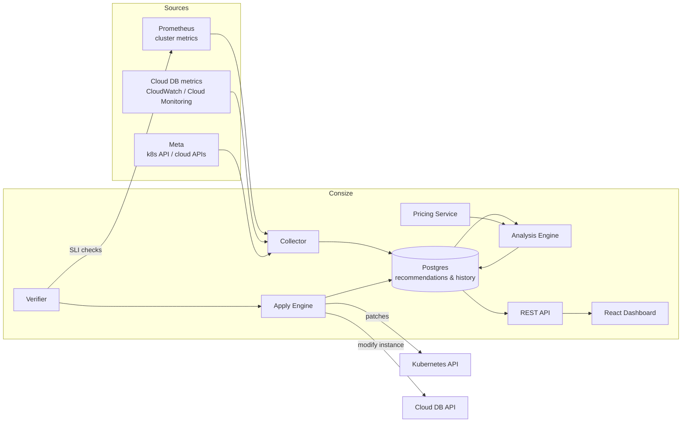

# Consize

> **Consize your infrastructure** — find the waste, fix it safely, prove the savings.

Consize analyzes real resource usage across two surfaces — **Kubernetes workloads** (pod requests/limits) and **databases** (instance sizing) — and produces safety-gated, rollback-protected recommendations. The savings number is the demo; the safety engine is the product.

| | |
|---|---|
| **Status** | **M1 shipped** (compute-surface analyze pipeline) — see [`docs/plan.md`](docs/plan.md) |
| **Mission** | One platform that answers: *"what is the waste in my infrastructure, and how do I remove it without breaking anything?"* |
| **Standard** | Production-grade, end-to-end: IaC → engine → UI → CI/CD → security → observability → docs |

---

## Why this product

- Pods request 8 GB and use 300 MB. DB instances run at 15% utilization on five-figure annual bills.
- Rightsizing is today a spreadsheet exercise nobody does, so the waste compounds silently.
- Existing tools either scan (report-only) or act blindly. **Consize is the platform that acts safely**: analyze → recommend → apply → verify → roll back.

## What it does

| Surface | Input | Output |
|---|---|---|
| **Compute** (k8s) | 14-day CPU/memory usage percentiles + current requests/limits | Per-workload request/limit recommendations, savings estimate, safe apply |
| **Data** (DB) | DB utilization (CPU, memory, IOPS, connections over time) | Instance size recommendation with headroom guarantees, maintenance-window apply |

Both surfaces run on one shared engine: **analyze → recommend → apply (guarded) → verify → rollback on regression**.

## Architecture at a glance



## Repository layout

```
consize/
├── README.md
├── docs/                  # architecture, plan, testing, security, observability, demo, ADRs
├── infra/                 # Terraform: cluster, prometheus, rds, iam, network
├── engine/                # Go monolith (vertical slices), cmd/ + internal/
│   └── ui/                # read-only dashboard (vanilla static SPA, embedded in the API binary)
├── deploy/                # dev/prod runbooks and environment helpers
├── .github/workflows/     # ci, scan, deploy pipelines
└── tests/                 # e2e + synthetic workload fixtures
```

## Try the demo

The engine ships with the artifacts the whole product is built on — deterministic fixture workloads covering the full policy surface, and golden-fixture tests with hand-computed expectations:

```sh
cd engine
make test    # go test ./...  — analysis policy + golden fixtures
make demo    # go run ./cmd/demo — the 60-second demo report
```

`make demo` runs the analysis engine against the 10 shipped fixture workloads — inflated requests, a bursty workload, an excluded workload, a protected namespace, stateful risk, insufficient data, and an already-optimal workload — and prints the recommendation report with projected monthly savings.

### The M1 pipeline (shipped)

The full analyze surface runs as four binaries with a Postgres store between them — no cluster required to run them, everything falls back to an in-memory store when `DATABASE_URL` is unset:

```sh
cd engine
make test                    # all packages: policy, store, collector, API, pricing
make demo                    # engine demo report (fixture workloads)

go run ./cmd/migrate         # apply embedded schema migrations to Postgres
go run ./cmd/collector       # k8s metadata + Prometheus → usage_buckets
                             #   (needs KUBECONFIG / PROMETHEUS_URL)
go run ./cmd/analyze         # buckets → recommendations (supersedes stale pending)
go run ./cmd/api             # REST API on :8080
```

```sh
curl localhost:8080/healthz               # {"status":"ok"}
curl localhost:8080/readyz                # store reachable → ready
curl localhost:8080/api/v1/workloads
curl localhost:8080/api/v1/recommendations?status=pending
curl localhost:8080/api/v1/savings        # projected $ + active count + active price table
```

Environment: `DATABASE_URL`, `PROMETHEUS_URL`, `CONSIZE_KUBECONFIG`, `CONSIZE_STEP` (15m), `CONSIZE_WINDOW` (14d), `CONSIZE_PRICING` (`static` | `aws`), `CONSIZE_LISTEN_PORT` (8080). The collector and analyzer are one-shot by design — a CronJob on a 15-minute cadence is the intended deployment (ADR-011).

### Dev and prod split

Local dev runs on your machine with its own Postgres and fixture-backed sources
by default:

```sh
cp deploy/dev/.env.example deploy/dev/.env
./deploy/dev/start-db.sh
./deploy/dev/start-api.sh
./deploy/dev/start-ui.sh
```

Seed or refresh local fixture data:

```sh
./deploy/dev/run-cycle.sh
```

Production is the live GKE installation and must be selected explicitly:

```sh
cp deploy/prod/env.sh.example deploy/prod/env.sh
./deploy/prod/check-context.sh
./deploy/prod/port-forward-api.sh
```

Then point the UI at prod only when intended:

```sh
cd ui
API_UPSTREAM=http://127.0.0.1:18099 npm run dev
```

See [docs/environments.md](docs/environments.md).

### The M2 safety surface (shipped)

The apply engine turns recommendations into *guarded, verified* changes — dry-run first, then apply, verify, and auto-rollback on regression. Nothing applies silently:

```sh
go run ./cmd/api             # + apply endpoints (503 without a cluster write identity)
go run ./cmd/verify          # verifier CronJob: due applies → verdict → rollback on FAIL
```

```sh
# Dry-run a recommendation: guardrails + step plan, nothing touched
curl -X POST localhost:8080/api/v1/recommendations/1/apply \
  -d '{"mode":"dry_run"}'
#   → {"EventID":…,"DryRun":true,"StepNumber":1,"TotalSteps":4,"Diff":{…}}

# Approved apply (requires an actor; audit trail records them)
curl -X POST localhost:8080/api/v1/recommendations/1/apply \
  -d '{"mode":"approved","actor":"alice"}'          # 422 with reasons when blocked

curl localhost:8080/api/v1/applies                  # apply_events trail (newest first)
curl localhost:8080/api/v1/verification-runs        # verdicts + SLI evidence
```

The safety model in one line: **six guardrails before the patch** (store health, pending-only, exclusions win, mode policy, ≤ 30% step, no concurrent applies per namespace + global cap), **one write surface** (resourceVersion-guarded patches; rollback is the same surface), **three verdicts** (`passed` | `failed` | `inconclusive` — rollback fires only on FAIL, inconclusive is recorded, never silent). Larger reductions step down 30% at a time, each step's follow-up waiting for the previous one to verify.

Write identity: `engine/deploy/rbac.yaml` — a least-privilege ServiceAccount (deployments only, per-namespace RoleBindings in auto-apply namespaces only), used by both apply and verify. See [docs/security.md](docs/security.md) and ADRs 017–023.

The M2 safety loop has been exercised end-to-end on a **live GKE cluster** (2026-08-24, `devops-portfolio`): Track 1 PASS on `boutique/frontend`, Track 2 FAIL → auto-rollback on a synthetic canary, least-privilege RBAC matrix, full audit trail in a live Postgres — runbook and evidence in [docs/e2e.md](docs/e2e.md). The E2E found a real rollback-drift bug (ADR-026) and proved the no-baseline conservatism (ADR-027) and the durable-SLI-storage requirement (ADR-028).

The M2 debt is closed (ADR-029, 2026-08-25) and the cluster runs the new build: `GET /api/v1/recommendations` is paginated (`?limit=` default 100 / cap 500, `?offset=`, and `pagination.total` in every response), superseded rows are pruned by age after each analyze cycle (`CONSIZE_REC_RETENTION`, default 168 h), and a **read-only dashboard is embedded in the API binary** — open `GET /` on a running API to see Dashboard / Recommendations / Audit. It is a vanilla static SPA (no build step, no CDN) under `engine/ui/`, still in its v1: no apply buttons by design.

### The M3 data surface (shipped, engine-complete)

The M3 milestone unifies **databases into the existing model** (ADR-030): DB instances are Workloads (`Source="db"`), DB metrics ride `usage_buckets` (`db_cpu_percent`, `db_iops`, `db_connections`, `db_mem_percent`, `db_errors`), and DB recommendations are Recommendations with `Resource="class"` plus a `ClassCurrent`/`ClassProposed` pair — one dashboard, one savings number for both surfaces. The engine is complete and fully tested:

- **Analysis** — class-catalog candidate search with utilization caps (CPU < 60%, IOPS < 60%, mem < 75%, conns < 70%), cheapest-fit with bottleneck attribution when nothing fits ("kept … bottleneck X").
- **Apply** — `internal/dbapply` mirrors the k8s guardrail pipeline and adds the two DB-specific rules (ADR-031): a weekly **maintenance window** (fail-closed when unconfigured; dry-runs exempt from timing) and **one class step per apply** (multi-step moves queue follow-up recommendations). Approval is the default: `mode=auto` needs the `consize.savings.dev/auto-db=enabled` label. The provider is a stub seam until a live CloudWatch/Cloud Monitoring integration lands.
- **Verification** — `verifier/db.go` judges store buckets against the **absolute analysis caps on the applied class** (ADR-032), with per-bucket error medians; FAIL auto-rolls-back to the event's pre-apply class. `Verify` dispatches class events to the DB path internally.
- **API** — `POST /api/v1/recommendations/{id}/apply` routes on the recommendation's `Resource` (class → DB engine, cpu/memory → k8s engine); class apply responses carry the step plan, maintenance-window state, and follow-up id; `GET /api/v1/recommendations` surfaces `ClassCurrent`/`ClassProposed`.

## Quick links

- [Architecture](docs/architecture.md) — components, data flow, interfaces
- [Plan](docs/plan.md) — milestones, tasks, acceptance criteria
- [Testing](docs/testing.md) — unit → integration → e2e, rollback & safety tests
- [Security](docs/security.md) — least privilege, secrets, audit, supply chain
- [Observability](docs/observability.md) — instrumentation, dashboards, alerting
- [Demo script](docs/demo.md) — the 10-minute story
- [Decisions (ADRs)](docs/decisions.md) — why each choice was made
- [Reference](docs/reference.md) — all ADRs, the mathematical calculations, and the terminology in one file

## License

MIT
